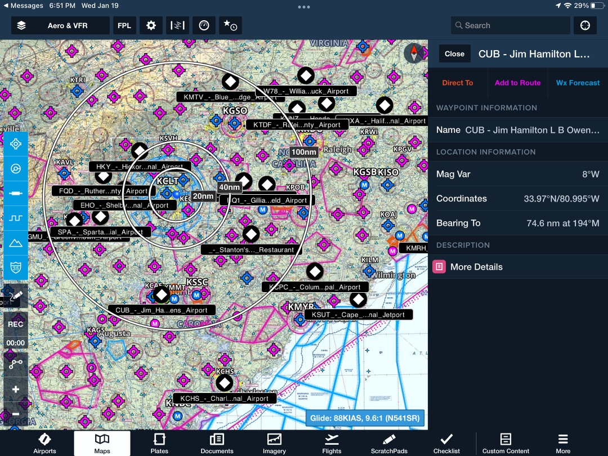
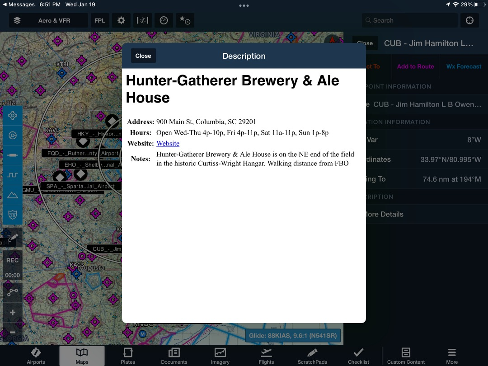

# aerowood-flying-to-food

## Overview

This project generates a custom [ForeFlight](https://www.foreflight.com/) layer (a [KML](https://en.wikipedia.org/wiki/Keyhole_Markup_Language) file) containing interesting restaurants and locations in the Southeastern United States for use by pilots in search of $100 hamburgers.

Did we miss a spot? Please feel free to submit a Pull Request and we will add it in!

> Inspiration and content is largely based on the [original Word Document](https://aerowoodaviation.com/site/wp-content/uploads/2021/04/Flying-to-Food.pdf) compiled by **Ron Horton** of [Aerowood Aviation](https://aerowoodaviation.com/) in Monroe, North Carolina.
# aerowood-flying-to-food
